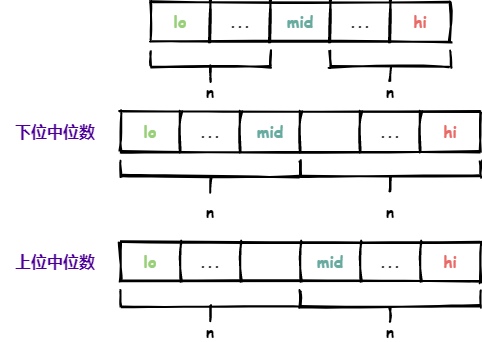
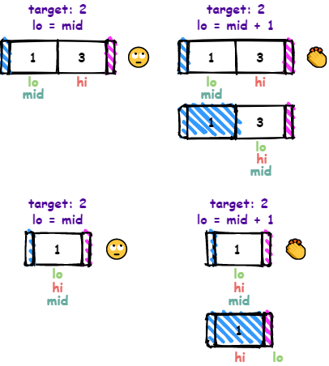
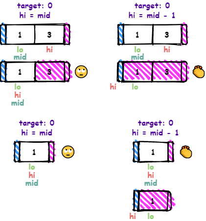
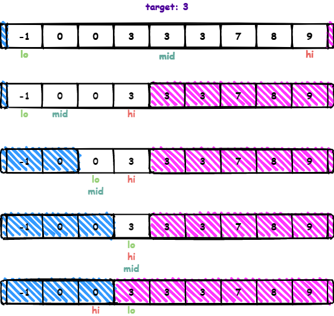

# 二分法

参考：

[二分法](https://www.zhihu.com/question/36132386)

以下界函数为例，该函数返回非递减数组中大于等于 `target` 的下界的索引。

```java
public static int lowerBound(int[] array, int target) {
    int lo = 0;
    int hi = array.length - 1;
    while (lo <= hi) {
        int mid = lo + ((hi - lo) >> 1);
        if (array[mid] < target) {
            lo = mid + 1;
        } else {
            hi = mid - 1;
        }
    }
    return lo;
}
```

其中 `[lo, hi]` 是待处理的元素，所以需要 `lo > hi` 为终止条件。

`[0, lo)` 是小于 `target` 的元素；`(hi, array.length-1]` 是大于等于 `target` 的元素。

---

**中位数**可以分为两种，分别是**下中位数**和**上中位数**。

- 下位中位数
    - `mid = lo + ((hi - lo) >> 1)`
    - `mid = (lo + hi) >> 1`
- 上位中位数
    - `mid = lo + ((hi - lo + 1) >> 1)`
    - `mid = (lo + hi + 1) >> 1`

需要注意的是 `mid = (lo + hi) >> 1` 和 `mid = (lo + hi + 1) >> 1` 的形式可能会导致溢出，所以建议不要使用。

下位中位数和上位中位数在奇数长度数组时相同，在偶数长度数组时不同。



---

```java
if (array[mid] < target) {
    lo = mid + 1;
} else {
    hi = mid - 1;
}
```

如果 `mid` 元素小于 `target`，那么小于 `target` 的元素应该是 `[0, mid]` <=> `[0, mid+1)`

理论上，可以将更新弱化，将 `lo = mid+1` 弱化为 `lo = mid` 也是可以的。相应的 `[0, mid)` 就是小于 `target` 的元素范围，是 `[0, mid+1)` 的子集。但是由于 `mid` 是 `lo` 和 `hi` 的下中位数，当 `hi - lo < 2` 时，下中位数 `mid` 仍然是 `lo`，如果 `lo = mid`，并不能缩小 `[lo, hi]` 的范围，会陷入死循环。



如果 `mid` 元素大于等于 `target`，那么大于等于 `target` 的元素应该是 `[mid, array.length-1]` <=> `(mid-1, array.length-1]`

理论上，可以将更新弱化，将 `hi = mid - 1` 弱化为 `hi = mid` 也是可以的，相应的 `(mid, array.length-1]` 就是大于等于 `target` 的元素范围，是 `(mid-1, array.length-1]` 的子集。但是由于 `mid` 是 `lo` 和 `hi` 的下中位数，当 `hi - lo < 1` 时，下中位数 `mid` 是 `hi`，如果 `hi = mid`，并不能缩小 `[lo, hi]` 的范围，会陷入死循环。



---

以数组 `{-1, 0, 0, 3, 3, 3, 7, 8, 9}`，`target` 等于 `3` 为例，执行过程如下：



在 `[lo, hi]` 处理完成之后，`lo` 是大于等于 `target` 的元素索引下界；`hi` 是小于 `target` 的元素索引上界。

---

如果将while的条件改为 `lo < hi`

条件可以宽松，具体表现为

如果是下中位数：`lo` 必须为 `mid + 1`，但hi可以为 `mid`，也可以是 `mid - 1`
如果是上中位数：`lo` 可以为 `mid`，也可以是 `mid + 1`，但hi必须是 `mid - 1`

终止条件是 `lo == hi`