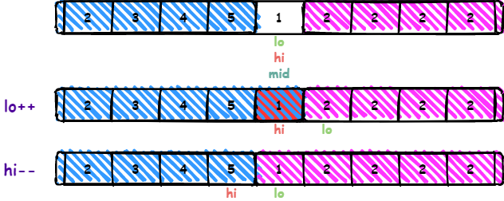
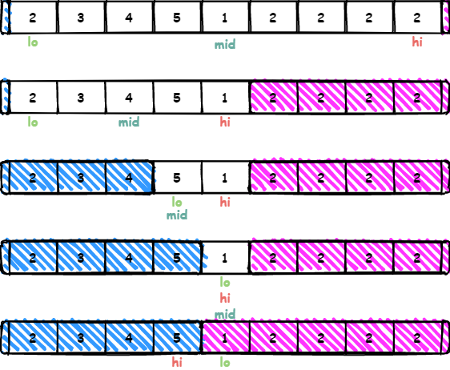

这是一道对二分查找算法灵活运用的一道题目。

二分查找算法不限于运用在有序数组上。

这种二分查找难就难在，`array[mid]` 跟谁比？如何判断最小元素在哪一侧？

一般的比较原则有：

- 如果有目标值 `target`，那么直接让 `array[mid]` 和 `target` 比较即可。
- 如果没有目标值，一般可以考虑 **端点**

**比较原则1**：把 `target` 看作是**右端点**，来进行分析，那就要分析以下三种情况，看是否可以达到上述的目标。

- 情况1，`array[mid] > target`：`4 5 6 1 2 3`
    - `array[mid]` 为 6，`target` 为右端点 3， `array[mid] > target`, 说明`[lo ... mid]` 都是 >= `target` 的，因为原始数组是非递减，所以可以确定答案为 `[mid+1...hi]`区间,所以 `lo = mid + 1`
- 情况2，`array[mid] < target`:`5 6 1 2 3 4`
    - `array[mid]` 为 1，`target`为右端点 4， `array[mid] < target`, 说明答案肯定不在 `[mid+1...hi]`，但是 `array[mid]` 有可能是答案,所以答案在`[lo, mid]`区间，所以`hi = mid`
- 情况3，`array[mid] == target`:
    - 如果是 `1 0 1 1 1`， `array[mid] = target = 1`, 显然答案在左边
    - 如果是 `1 1 1 0 1`, `array[mid] = target = 1`, 显然答案在右边
    - 所以这种情况，不能确定答案在左边还是右边，那么就让 `hi = hi - 1` 或者 `lo = lo + 1` 慢慢缩少区间，同时也不会错过答案。

如果把**左端点**看成`target`

- 情况1 ：`1 2 3 4 5` ， `array[mid] = 3`, `target = 1`, `array[mid] > target`, 答案在 `mid` 的左侧
- 情况2 ：`3 4 5 1 2` ， `array[mid] = 5`, `target = 3`, `array[mid] > target`, 答案却在 `mid` 的右侧

---

**比较原则2**：也可以通过其他方式，判断在 `mid` 的哪一侧，而不是使用单独一个 `target` 来判断

- 如果 `array[mid] > array[hi]`，最小元素一定在 `[mid+1, hi]` 之间
- 如果 `array[mid] > array[lo]`，最小元素一定在 `[lo, mid]` 之间，因为不确定 `array[mid]` 是否为最小值
- 否则应该通过 `hi = hi - 1` 或者 `lo = lo + 1` 慢慢缩少区间，同时也不会错过答案。

---

`[lo, hi]` 是要处理的元素，即最小元素在其中；循环不变量 `[0, lo)` 是非递减的数组，循环不变量 `(hi, array.length-1]` 是非递减数组。

- **终止条件1**是 `lo > hi`，终止后 `lo` 是最小元素的索引，`hi` 是最大元素的索引。
- **终止条件2**是 `lo == hi`，此时 `[lo, hi]` 中只有一个元素，其最小值在 `[lo, hi]` 中，所以该元素一定是最小元素。

---

如果使用终止条件1，需要注意的是当 `lo == hi` 时，应该使用 `hi = hi - 1` 来缩小区间，否则不满足循环不变量。



---

最后代码如下，使用的是**终止条件1**，**比较原则1**

```java
public int minNumberInRotateArray(int [] array) {
    if (array.length == 0) {
        return 0;
    }
    int lo = 0;
    int hi = array.length - 1;
    while (lo <= hi) {
        int mid = lo + ((hi - lo) >> 2);
        if (array[mid] > array[hi]) {
            lo = mid + 1;
        } else if (array[mid] < array[hi]) {
            hi = mid;
        } else {
            hi--;
        }
    }
    return array[lo];
}
```

执行结果如下



---

- **比较原则1**：使用 `array[hi]` 作为 `target`
- **终止条件2**：在 `lo == hi` 时就可以终止循环，`lo` 和 `hi` 都是最小元素的索引
- **使用 `lo++` 缩小范围**：不用考虑循环不变量，所有 `lo++` 和 `hi--` 都可以

```java
public int minNumberInRotateArray(int [] array) {
    if (array.length == 0) {
        return 0;
    }
    int lo = 0;
    int hi = array.length - 1;
    while (lo < hi) {
        int mid = lo + ((hi - lo) >> 2);
        if (array[mid] > array[hi]) {
            lo = mid + 1;
        } else if (array[mid] < array[hi]) {
            hi = mid;
        } else {
            lo++;
        }
    }
    return array[lo];
}
```

---

**终止条件1**，**比较原则2**：同样也能正常运行

```java
public int minNumberInRotateArray(int [] array) {
    if (array.length == 0) {
        return 0;
    }
    int lo = 0;
    int hi = array.length - 1;
    while (lo <= hi) {
        int mid = lo + ((hi - lo) >> 2);
        if (array[mid] > array[hi]) {
            lo = mid + 1;
        } else if (array[lo] > array[mid]) {
            hi = mid;
        } else {
            hi--;
        }
    }
    return array[lo];
}
```